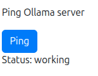
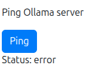
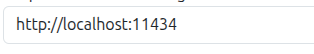
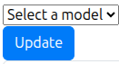

# ai-ui
A web UI in React for Ollama ai models
# How to use
Using AI UI is easy after setting it up
**Requirements**
- [Node JS](https://nodejs.org/en/download/)
- NPM: download node js with NPM
- [Git](https://git-scm.com/install/)

**Clone and install packages**
Clone the repo:
```
git clone https://github.com/thenamelessdev/ai-ui.git
```
if you are having trouble installing git then download the zip file in [the repo](https://github.com/thenamelessdev/ai-ui)

Then run this to install the packages (make sure you are in the folder where the code is):
```
npm install
```

**Starting**
After installing the packages you can run this to start:
```
npx vite
```
if you did everything correctly it should start the server and give you it's ip

**Usage**
Make sure that you started the Ollama server
Press the ping button and if it writes working then everything's fine

if it writes error:

then make sure that the server is running the you have the correct ip address. If the ip is not the default then you can change it at the bottom of the page:

and press Ping again

To ask ai a question make sure you have at least one model installed and then press Update to update the model list:

If you have models installed then you should see them in the dropdown menu and select it
After you selected it you can write the message in the Messafe input under the update button.
After you wrote your message press send to send it. After the model finished (it might take a while) you should see the response at the Response text